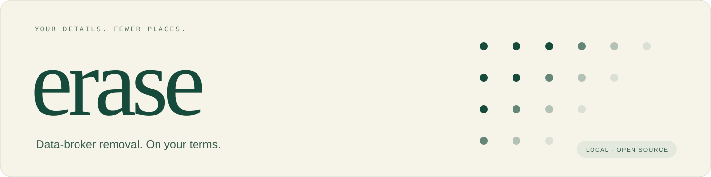
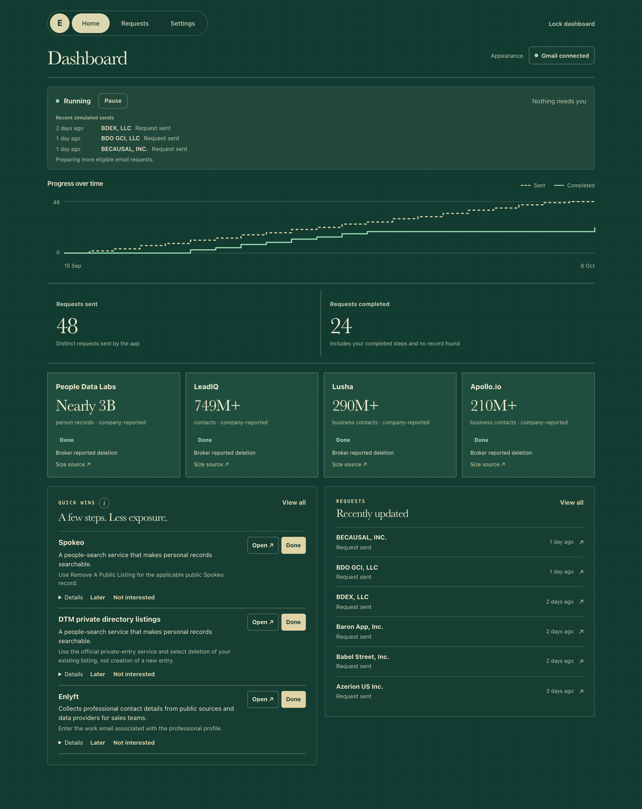

<p align="center">
  
</p>

<p align="center">
  <strong>Put data-broker removal requests on autopilot.</strong><br>
  Automatic emails, organized replies, and clear next steps, from your own Mac.
</p>

<p align="center">
  <a href="#get-started">Get started</a> &nbsp; · &nbsp;
  <a href="#take-a-look-first">Try the demo</a> &nbsp; · &nbsp;
  <a href="#your-campaign-your-computer">Privacy</a> &nbsp; · &nbsp;
  <a href="LICENSE">MIT license</a>
</p>

<p align="center"><sub>Free, open source · Mac friends alpha · Automatic emails for EU/EEA residents</sub></p>

---

Data brokers collect and distribute personal information for people-search,
sales outreach and marketing. Asking them to remove it can mean a lot of emails,
forms and follow-ups. **erase keeps that work moving, and brings it into one place.**

<p align="center"><sub>Real interface, fictional demo data. The sample outcomes are not broker deletion claims.</sub></p>



<p align="center"><sub>Shown in Conservatory. Porcelain, Atelier and Midnight are also included.</sub></p>

## Start once. Let the email work continue.

| Emails handled | Replies organized | A few steps for you |
| --- | --- | --- |
| Sends eligible removal requests, checks your inbox and schedules supported follow-ups. | Keeps each broker's messages, current status and history together. | Links directly to reviewed forms and flags verification or information only you can provide. |

The campaign runs without a coding assistant. **Codex or Claude Code helps you
install it; erase takes over after you select Start.** Optional reply assistance
can help classify what comes back.

### A researched starting point

**80 reviewed automatic email workflows · 141 guided manual routes** in the current
alpha. Each has recorded instructions, country scope and official sources.
Your country and the information a broker needs determine which routes apply.

This includes databases such as People Data Labs, Apollo, Lusha and LeadIQ, alongside
people-search and marketing routes. Credit, insurance and fraud records stay outside
the default campaign. The larger research catalog is not a list of working integrations
or a claim that those companies hold your data.

[Browse the broker knowledge](catalog/broker-knowledge.yml) ·
[See the declared alpha routes](catalog/mvp-cohort.yml) ·
[Coverage and known gaps](docs/major-broker-coverage-2026-10-04.md)

## Get started

### 1. Download and open

[Download the source ZIP](https://github.com/juliusknl/erase/archive/refs/heads/main.zip),
unzip it, and keep the folder somewhere permanent, such as Documents.
Open it in **Codex or Claude Code** with local terminal access.

### 2. Paste this

```text
Read docs/assistant-setup.md, install and open erase, then guide me through Gmail setup one step at a time. Keep my data private; I'll enter secrets and click Start.
```

The assistant handles installation and explains the account steps. You enter your
details and approve access directly in the app, never by pasting secrets into chat.

### 3. Follow the guided setup

**Choose a look → country → your info → Gmail → review and Start.**

The dashboard shows what was sent, what is finished and anything that needs you.
The default sending limit is 20 automatic emails a day; remaining requests continue
on later days. Pause sending whenever you want.

**Before you begin:**

- A **Mac with FileVault enabled**. No Docker, Homebrew, Xcode, manual Python
  installation or `.env` editing is needed for this setup.
- A **personal Gmail account**, preferably a separate inbox for broker requests.
  Your usual personal/work emails go in Your info so brokers can match existing records.
- Your own **Google project** to connect Gmail. The app has a setup helper;
  this is still the most hands-on part. A paid server isn’t needed. Testing-mode
  connections normally require reconnecting after seven days.
- Automatic emails currently support **EU/EEA residents**. Reviewed manual routes
  cover additional countries; Windows/Linux unattended operation is not validated.

[Setup help and recovery](docs/friends-preview.md) ·
[Instructions for your assistant](docs/assistant-setup.md)

<details>
<summary><strong>Prefer to install it yourself?</strong></summary>

On a Mac with FileVault enabled, install [uv](https://docs.astral.sh/uv/getting-started/installation/)
and run this from the folder containing `pyproject.toml`:

```sh
uv run --locked erase
```

uv installs the locked dependencies and Python if needed. The guided setup opens
at **http://127.0.0.1:8787**. Choose a new local dashboard password of at least
12 characters and approve your Mac’s Keychain prompts yourself.

To reopen, use the same command. To quit the background process completely:
`uv run --locked erase --stop`. Keep the source folder in place.

</details>

## Take a look first

Explore the same interface with made-up details and a simulated mailbox:

```sh
uv run --locked erase-demo
```

Open **http://127.0.0.1:8788**. Password: **`try-erasure-demo`**.
No real mail, Google connection or AI credits are used. Keep this demo terminal open;
stop it with Ctrl-C. It has its own data and does not reset a real installation.

[More about the isolated demo](docs/demo.md)

## Your campaign. Your computer.

Your profile, credentials and correspondence are encrypted locally. The Mac launcher
keeps its keys in **macOS Keychain**. There is no erase account or hosted erase service.

Removal emails necessarily share matching information with brokers through Gmail.
The app limits each reviewed request to the details it needs. **Phone numbers,
birth dates, ID documents and attachments are never sent automatically.**

Reply assistance is optional: **Jev or an eligible ChatGPT account** can help sort
replies. It sends minimized reply text to the provider you choose. Ordinary email
sending does not depend on AI.

[Privacy](docs/PRIVACY.md) · [Security](SECURITY.md) ·
[Reply assistance](docs/chatgpt-reply-assistance.md)

## Good to know

**Is it free?**
The software is free and MIT licensed, with no erase subscription. Standard Gmail
API usage is available at no additional cost within [Google’s limits](https://developers.google.com/workspace/gmail/api/reference/quota). Optional AI
uses the provider’s credits or your eligible account’s allowance.

**Can I close the app?**
You can close the browser and terminal after starting erase. It runs in the background,
pauses while the Mac sleeps and resumes on wake. Enable **Start erase when I log in**
if you want it to return after a restart. It cannot work while the Mac is asleep or off.

**Does Done mean every copy of my data is gone?**
No. Done includes broker-reported deletion, no record found and manual steps you
marked complete. Each request keeps its specific outcome and messages. Sending a
request does not guarantee deletion, and suppression can differ from erasure.

**Is this a complete Incogni replacement?**
Not yet. This is a friends alpha with reviewed routes, working automation and a
small trial still ahead. Some brokers require a form or direct email handling.
There is no guarantee of complete coverage, deletion or a fixed weekly workload.
erase is not affiliated with Incogni or any broker.

## Help make it better

Try it, then tell us where you got stuck. A useful report is short: the step,
what you expected, what happened, and your macOS version. **Redact screenshots;
never share your database, mail, credentials or Google configuration.**

Broker corrections are especially welcome: official source, country scope,
required information and the date checked.

[Contributing](CONTRIBUTING.md) · [Broker support](docs/BROKER_SUPPORT.md) ·
[Verification and limitations](docs/friends-alpha-2026-10-06.md)

<details>
<summary><strong>For developers</strong></summary>

```sh
uv sync --locked --dev
uv run --locked ruff check src tests scripts
uv run --locked pytest -q
uv run --locked python scripts/release_check.py
```

Tests use synthetic identities and mocked providers, never the real mailbox.
GitHub CI covers Python 3.11–3.13, Chromium/WebKit and container validation.
The declared pilot gate is separate from the incomplete full-inventory gate.

[Campaign design](docs/campaign-implementation.md) ·
[Knowledge foundation](docs/european-knowledge.md) ·
[Threat model](docs/THREAT_MODEL.md) ·
[Desktop build](docs/desktop-preview.md)

</details>

---

<p align="center"><sub>Made to give you a little less to keep track of.<br><a href="LICENSE">MIT</a> · <a href="THIRD_PARTY_NOTICES.md">Third-party notices</a></sub></p>
